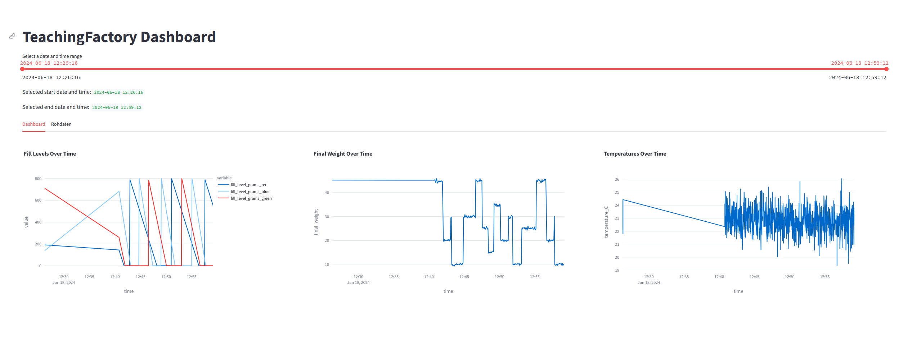

# Abschlussprojekt Automatisierungstechnik (Thöni, Unterhuber, Peer)

## Aufgabe 12.1 Senden und Empfangen von Daten
Die Erfüllung dieser Aufgabe ist unter "mqtt_client/subscriber.py" zu finden. Der Publisher der SPS-Seite findet sich im TwinCAT-Projekt

## Aufgabe 12.2 Speichern der Daten
Gespeichert werden die erhaltenen Daten als .json-File in "database/db.json", realisiert mit tinydb. Die Aufarbeitung der Datenbank findet in "root/aufarbeitung. py" statt. Zur einfachen Verwendung in anderen Dateien wurden viele aufbereitete DataFrames auch als .csv-Datei exportiert.
Der MQTT-Zugang und die gewünschten Topics können unter "mqtt_client/config.ini" definiert werden.  
Es wurde außerdem ein Dashboard via streamlit realisiert (visualisierung/streamlit.py), mit der verschiedenste Werte über eine beliebige Zeitreihe visualisiert werden können.  

## Aufgabe 12.3 Regressionsmodell
Das File "root/regression.py" beinhaltet die Bildung der Regressionsgeraden des Datensatzes. Das ausgewertete Ergebnis wird anschließend in "root/regression_results.md" abgebildet. Die Prognose von 'X.csv' wurde unter "database/52216067-62200066-61901292.csv" abgespeichert.

## Aufgabe 12.4 Klassifikationsmodell
Im File "root/classification.py" wurden mehrere Klassifizierungsmodelle ausprobiert, unter anderem Decision-Tree, KNNeighbors und Logistic Regression. Die Auswertung findet sich unter "root/classification_results.md". Die Fourier-Transformation wurde ebenfalls in "root/aufarbeitung.py" umgesetzt.